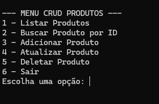
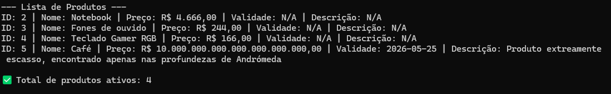

# CRUD de Produtos - Aplicação Console com SQLite

## 📦 Funcionalidades

- **Listar produtos:** Visualizar todos os produtos ativos cadastrados.
- **Buscar produto por ID:** Buscar um produto específico pelo seu ID.
- **Cadastrar produto:** Inserir um novo produto com validações de obrigatoriedades.
- **Atualizar produto:** Alterar dados de um produto existente.
- **Deletar produto:** Marcar um produto como inativo (soft delete).

## 📚 Estrutura do Projeto

```bash
ProjetoCRUD/
├── app.py               # Código principal da aplicação
├── criar_tabela_produto.sql  # Script SQL para criação da tabela
├── produtos.db          # Banco de dados SQLite
├── test_app.py          # Testes unitários do projeto
├── app.log              # Arquivo de logs gerados pela aplicação
├── Dockerfile           # Arquivo para conteinerizar a aplicação
├── README.md            # Documentação do projeto
└── .gitignore           # Arquivos ignorados pelo Git
```

## 📁 Sobre o Recurso (Produto)

- `nome` (obrigatório - texto)
- `preco` (obrigatório - número real)
- `data_validade` (opcional - data formato AAAA-MM-DD)
- `descricao` (opcional - texto)
- `status` (interno - ativo/inativo)

## 🛠️ Tecnologias Utilizadas

- Python 3.x
- SQLite3
- Docker
- Unittest (biblioteca de testes do Python)
- Logging (para geração de logs)

## 🔧 Como Executar o Projeto

### 1. Executar Localmente

```bash
git clone https://github.com/Mariacpdb/API-cadastro-de-produtos.git
python app.py
```

O banco de dados `produtos.db` será criado automaticamente.

### 2. Executar via Docker

```bash
docker build -t crud-produtos .
docker run -it crud-produtos
```

## 🎓 Testes Unitários

Os testes estão no arquivo `test_app.py`, utilizando a biblioteca `unittest`.

### Rodar testes:

```bash
python -m unittest test_app.py
```

Os testes cobrem:

- Validação de preço
- Validação de data
- Validação de ID

## 🔒 Sistema de Logs

Todos os eventos importantes da aplicação são registrados em `app.log`, incluindo:

- Produtos cadastrados, atualizados e deletados.
- Validações de erros nas entradas de dados.

Os logs ajudam na depuração e análise de problemas futuros.

## 📸 Demonstração

### Tela de Menu


### Exemplo de Listagem de Produtos



## 💡 Melhorias Implementadas

- Tratamento completo de exceções.
- Validação de dados obrigatórios e opcionais.
- Formatação correta de valores monetários.
- Soft delete (mantendo histórico de produtos).
- Geração automática de banco e tabelas.
- Testes automatizados de funcionalidades principais.
- Documentação detalhada.
- Containerização com Docker.

---

**Desenvolvido por Maria Clara**